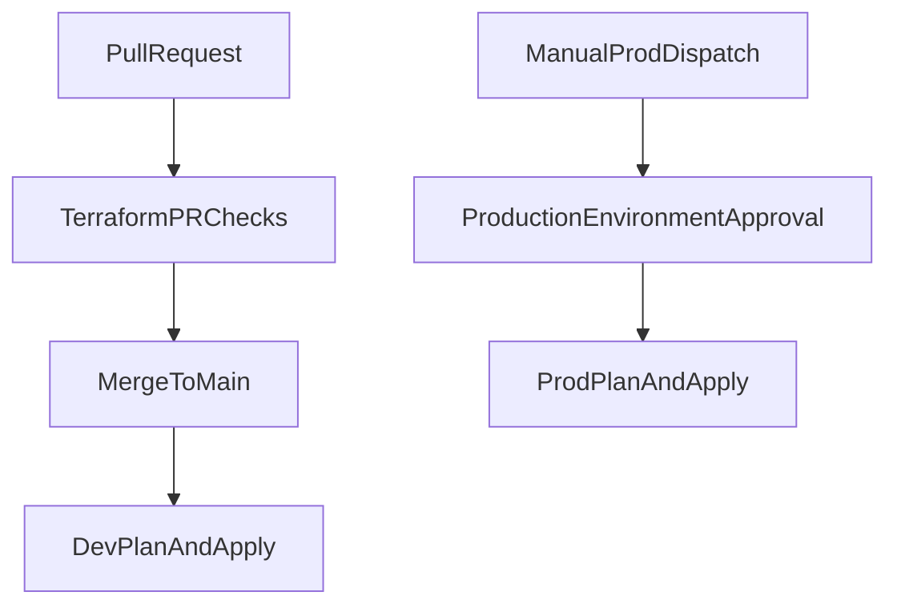

# Architecture

## Overview

This project demonstrates a safe Terraform CI/CD pattern using GitHub Actions and AWS OIDC federation.

- Pull requests trigger validation and planning for both environments.
- Merges to `main` deploy to `dev`.
- Production deployment is manual and uses a protected GitHub environment.

## CI/CD Flow

## Terraform Design

- A shared module (`modules/sample_infra`) manages one S3 bucket with:
  - versioning enabled
  - AES256 encryption enabled
  - public access blocked
- Environment roots (`environments/dev` and `environments/prod`) keep deployment behavior explicit.

## Authentication Model (OIDC)

GitHub Actions assumes AWS IAM roles using OIDC:

1. Workflow requests an OIDC token (`id-token: write`).
2. AWS IAM role trust policy validates repository and ref/environment constraints.
3. Temporary credentials are issued for Terraform execution.

No long-lived AWS access keys are required in repository secrets.

Example trust relationship constraints:

- `aud` should equal `sts.amazonaws.com`
- `sub` should restrict to approved branch/environment patterns, for example:
  - `repo:<ORG_OR_USER>/<REPO_NAME>:ref:refs/heads/main`
  - `repo:<ORG_OR_USER>/<REPO_NAME>:environment:production`

## Safety Controls

- Separate deploy workflows per environment
- Manual trigger for production
- Recommend required reviewers on GitHub `production` environment
- Serialized deployments with workflow `concurrency`
- Fork PRs run lint/validation but skip cloud-authenticated plan execution
